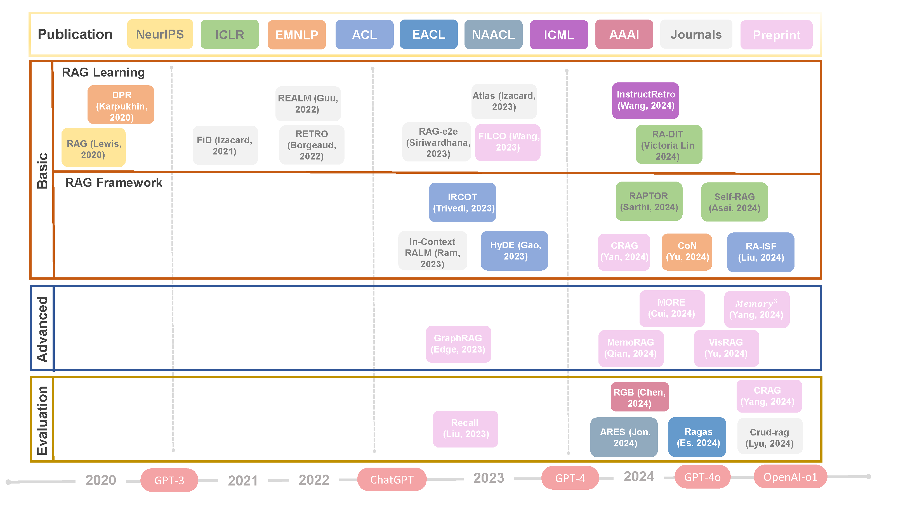
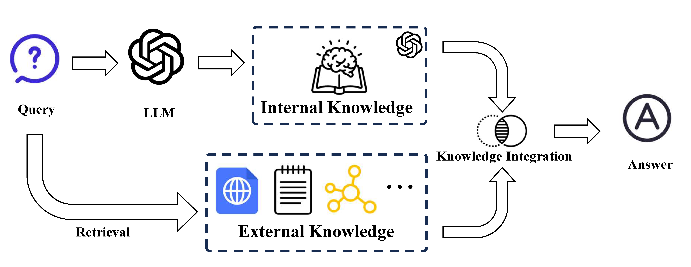
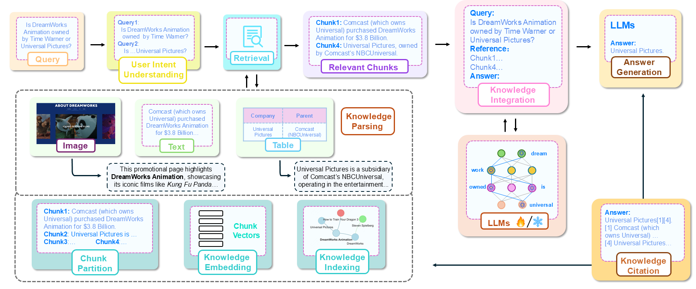
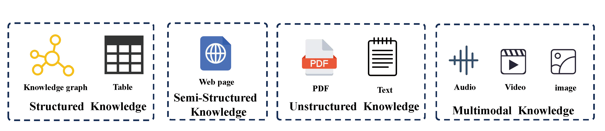
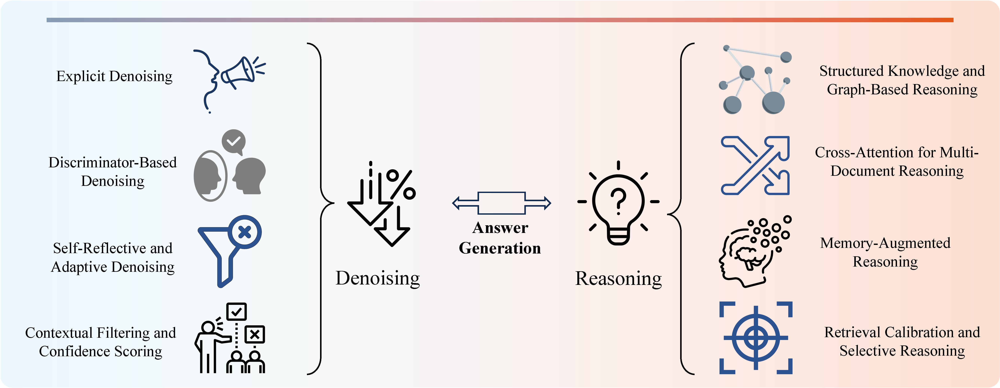
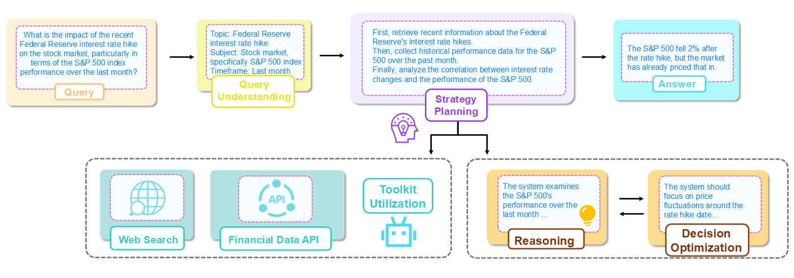

<div align="center">
  <!-- <h1><b> Time-LLM </b></h1> -->
  <!-- <h2><b> Time-LLM </b></h2> -->
  <h2><b> A Survey on Knowledge-Oriented Retrieval-Augmented Generation </b></h2>
</div>

<div align="center">


</div>

<div align="center">

**[<a href="https://arxiv.org/abs/2503.10677">Online Paper Download Link</a>]**

</div>

<p align="center">


</p>

---

> 🙋 Please let us know if you find out a mistake or have any suggestions!
>
> 🌟 If you find this resource helpful, please consider to star this repository and cite our research:

```bibtex
@article{cheng2025survey,
  title={A Survey on Knowledge-Oriented Retrieval-Augmented Generation},
  author={Mingyue Cheng and Yucong Luo and Jie Ouyang and Qi Liu and Huijie Liu and Li Li and Shuo Yu and Bohou Zhang and Jiawei Cao and Jie Ma and Daoyu Wang and Enhong Chen},
  journal={arXiv preprint arXiv:2503.10677},
  year={2025}
}
```

## Updates/News:

🚩 **News** (Oct. 2024): The preparatory phase was completed, including contributor confirmation and task allocation.

🚩 **News** (Jan. 2025): The main content of the survey was completed, with further refinements ongoing.

🚩 **News** (Mar. 2025): The final version of the survey was polished and successfully submitted to [arXiv](https://arxiv.org/abs/2503.10677).

## Introduction

This repository is dedicated to collecting and categorizing papers on Knowledge-Oriented Retrieval-Augmented Generation (RAG) based on our survey paper: _A Survey on Knowledge-Oriented Retrieval-Augmented Generation_. Given the rapid advancements in this field, we will continue to update both the paper and this repository.

<p align="center">

</p>

- RAG consists of three main components: (1) A query is processed by an LLM with its internal knowledge, (2) External knowledge is retrieved based on the query, and (3) Knowledge integration combines both internal and external knowledge to generate the final answer.

<p align="center">

</p>

### Basic RAG Approaches
<p align="center">

</p>

1. **User Intent Understanding**

   • [Query2doc: Query Expansion with Large Language Models](https://aclanthology.org/2023.emnlp-main.585)

   • [Tree of Clarifications: Answering Ambiguous Questions with Retrieval-Augmented Large Language Models](https://openreview.net/forum?id=vDvFT7IX4O)

   • [Precise Zero-Shot Dense Retrieval without Relevance Labels](https://doi.org/10.18653/v1/2023.acl-long.99)

   • [RQ-RAG: Learning to Refine Queries for Retrieval Augmented Generation](https://arxiv.org/pdf/2404.00610)

   • [Dynamic Contexts for Generating Suggestion Questions in RAG Based Conversational Systems](https://arxiv.org/pdf/2403.11413)

2. **Knowledge Source and Parsing**

   • [LESS: selecting influential data for targeted instruction tuning](https://arxiv.org/abs/2402.04333)

   • [Make-An-Audio: Text-To-Audio Generation with Prompt-Enhanced Diffusion Models](https://proceedings.mlr.press/v202/huang23i.html)

   • [Telco-RAG: Navigating the challenges of retrieval-augmented language models for telecommunications](https://arxiv.org/pdf/2404.15939)

<p align="center">

</p>

3. **Knowledge Embedding**

   • [C-Pack: Packaged Resources To Advance General Chinese Embedding](https://arxiv.org/abs/2309.07597)

   • [BGE M3-Embedding: Multi-Lingual, Multi-Functionality, Multi-Granularity Text Embeddings Through Self-Knowledge Distillation](https://arxiv.org/abs/2402.03216)

   • [LM-Cocktail: Resilient Tuning of Language Models via Model Merging](https://arxiv.org/abs/2311.13534)

4. **Knowledge Indexing**

   • [PineCone](https://www.pinecone.io)

   • [LlamaIndex](https://github.com/jerryjliu/llama_index)

   • [RAPTOR: RECURSIVE ABSTRACTIVE PROCESSING FOR TREE-ORGANIZED RETRIEVAL](https://arxiv.org/pdf/2401.18059.pdf)

5. **Knowledge Retrieval**

   • [Query Expansion by Prompting Large Language Models](https://doi.org/10.48550/arXiv.2305.03653)

   • [Rat: Retrieval augmented thoughts elicit context-aware reasoning in long-horizon generation](https://arxiv.org/abs/2403.05313)

   • [React: Synergizing reasoning and acting in language models](https://arxiv.org/abs/2210.03629)

6. **Knowledge Integration**

   • [Chain-of-thought prompting elicits reasoning in large language models](https://arxiv.org/abs/2201.11903)

   • [Large Language Models Know Your Contextual Search Intent: A Prompting Framework for Conversational Search](https://aclanthology.org/2023.findings-emnlp.86)

   • [ACTIVERAG: Revealing the Treasures of Knowledge via Active Learning](https://arxiv.org/abs/2402.13547)

7. **Answer Generation**

   • [Prompt Engineering Guide](https://github.com/dair-ai/Prompt-Engineering-Guide)

   • [Take a Step Back: Evoking Reasoning via Abstraction in Large Language Models](https://doi.org/10.48550/arXiv.2310.06117)

   • [Active Prompting with Chain-of-Thought for Large Language Models](https://doi.org/10.48550/arXiv.2302.12246)

<p align="center">

</p>

8. **Knowledge Citation**

   • [Citation-Enhanced Generation for LLM-based Chatbot](https://arxiv.org/pdf/2402.16063v1.pdf)

   • [KAUCUS: Knowledge Augmented User Simulators for Training Language Model Assistants](https://aclanthology.org/2024.scichat-1.5/)


### Advanced RAG Approaches

1. **RAG Training**

   • [Improving Language Models by Retrieving from Trillions of Tokens](https://proceedings.mlr.press/v162/borgeaud22a.html)

   • [When Language Model Meets Private Library](https://doi.org/10.18653/v1/2022.findings-emnlp.21)

   • [CodeGen: An Open Large Language Model for Code with Multi-Turn Program Synthesis](https://arxiv.org/abs/2203.13474)

2. **Multimodal RAG**

   • [Make-an-audio: Text-to-audio generation with prompt-enhanced diffusion models](https://proceedings.mlr.press/v202/huang23i.html)

   • [Retrievegan: Image synthesis via differentiable patch retrieval](https://arxiv.org/abs/2007.08513)

   • [Re-imagen: Retrievalaugmented text-to-image generator](https://arxiv.org/abs/2209.14491)

3. **Memory RAG**

   • [Memorizing transformers](https://openreview.net/forum?id=TrjbxzRcnf-)

   • [Memory-driven text-to-image generation](https://arxiv.org/abs/2208.07022)

   • [Mention memory: incorporating textual knowledge into transformers through entity mention attention](https://arxiv.org/abs/2110.06176)

4. **Agentic RAG**

   • [Retrieve Anything To Augment Large Language Models](https://arxiv.org/abs/2310.07554)

   • [Replug: Retrieval-augmented black-box language models](https://arxiv.org/abs/2301.12652)

   • [When Language Model Meets Private Library](https://doi.org/10.18653/v1/2022.findings-emnlp.21)

<p align="center">

</p>

### RAG Applications

1. **RAG for Text**

   • [Leveraging Passage Retrieval with Generative Models for Open Domain Question Answering](https://doi.org/10.18653/v1/2021.eacl-main.74)

   • [REALM: Retrieval-Augmented Language Model Pre-Training](https://arxiv.org/abs/2002.08909)

   • [Knowledge Graph Based Synthetic Corpus Generation for Knowledge-Enhanced Language Model Pre-training](https://doi.org/10.18653/v1/2021.naacl-main.278)

2. **RAG for Code**

   • [Retrieval-Based Neural Code Generation](https://doi.org/10.18653/v1/d18-1111)

   • [Retrieval Augmented Code Generation and Summarization](https://doi.org/10.18653/v1/2021.findings-emnlp.232)

   • [When Language Model Meets Private Library](https://doi.org/10.18653/v1/2022.findings-emnlp.21)

3. **RAG for Audio**

   • [Retrieval-Augmented Text-to-Audio Generation](https://doi.org/10.48550/arXiv.2309.08051)

   • [Large-Scale Contrastive Language-Audio Pretraining with Feature Fusion and Keyword-to-Caption Augmentation](https://doi.org/10.1109/ICASSP49357.2023.10095969)

   • [Make-an-audio: Text-to-audio generation with prompt-enhanced diffusion models](https://proceedings.mlr.press/v202/huang23i.html)

4. **RAG for Image**

   • [Retrievegan: Image synthesis via differentiable patch retrieval](https://arxiv.org/abs/2007.08513)

   • [Instance-conditioned gan](https://arxiv.org/abs/2109.05070)

   • [Memory-driven text-to-image generation](https://arxiv.org/abs/2208.07022)

5. **RAG for Video**

   • [Incorporating Background Knowledge into Video Description Generation](https://aclanthology.org/D18-1433/)

   • [Retrieval Augmented Convolutional Encoder-decoder Networks for Video Captioning](https://doi.org/10.1145/3539225)

   • [Concept-Aware Video Captioning: Describing Videos With Effective Prior Information](https://doi.org/10.1109/TIP.2023.3307969)

6. **RAG for 3D**

   • [ReMoDiffuse: Retrieval-Augmented Motion Diffusion Model](https://doi.org/10.1109/ICCV51070.2023.00040)

   • [AMD: Anatomical Motion Diffusion with Interpretable Motion Decomposition and Fusion](https://arxiv.org/abs/2312.12763)

   • [Retrieval-Augmented Score Distillation for Text-to-3D Generation](https://doi.org/10.48550/arXiv.2402.02972)

7. **RAG for Knowledge**

   • [ReTraCk: A Flexible and Efficient Framework for Knowledge Base Question Answering](https://doi.org/10.18653/v1/2021.acl-demo.39)

   • [Unseen Entity Handling in Complex Question Answering over Knowledge Base via Language Generation](https://aclanthology.org/2021.findings-emnlp.50/)

   • [Case-based Reasoning for Natural Language Queries over Knowledge Bases](https://doi.org/10.18653/v1/2021.emnlp-main.755)

8. **RAG for Science**

   • [Retrieval-based controllable molecule generation](https://arxiv.org/abs/2208.11126)

   • [Prompt-based 3d molecular diffusion models for structure-based drug design](https://openreview.net/forum?id=FWsGuAFn3n)

   • [PoET: A generative model of protein families as sequences-of-sequences](https://proceedings.neurips.cc/paper_files/paper/2023/hash/f4366126eba252699b280e8f93c0ab2f-Abstract-Conference.html)

## Benchmark

[Benchmarking Large Language Models in Retrieval-Augmented Generation](https://doi.org/10.48550/arXiv.2309.01431)

[CRUD-RAG: A Comprehensive Chinese Benchmark for Retrieval-Augmented Generation of Large Language Models](https://doi.org/10.48550/arXiv.2401.17043)

[ARES: An Automated Evaluation Framework for Retrieval-AugmentedGeneration Systems](https://doi.org/10.48550/arXiv.2311.09476)

[RAGAS: Automated Evaluation of Retrieval Augmented Generation](https://doi.org/10.48550/arXiv.2309.15217)

[KILT: a Benchmark for Knowledge Intensive Language Tasks](https://arxiv.org/abs/2009.02252)

## Contact
If you have any questions or suggestions, feel free to contact our team:

Current:
- Mingyue Cheng (mycheng@ustc.edu.cn)
- Yucong Luo (prime666@mail.ustc.edu.cn)
- Jie Ouyang (ouyang_jie@mail.ustc.edu.cn)
